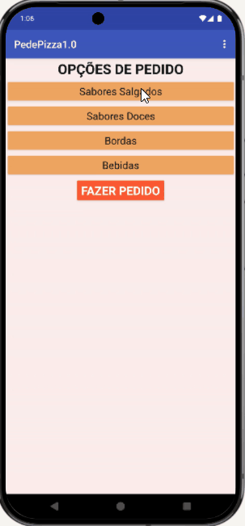

# 🍕 PedePizza — App de Pedido de Pizzaria

Aplicativo Android para montagem e envio de pedidos de pizza,
desenvolvido como projeto da disciplina **Fundamentos de Design de Sistemas**.

O app guia o cliente por quatro categorias de escolha — sabor salgado, sabor doce,
borda e bebida — até a confirmação do pedido em uma tela de resumo.

> [!NOTE]
> O projeto foi **prototipado no Figma** e **implementado no Kodular** (plataforma
> de desenvolvimento visual Android baseada em blocos), sem código nativo.

---

## 📱 Demonstração

---

## ⬇️ Como instalar

> [!IMPORTANT]
> Ative **"Instalar apps de fontes desconhecidas"** nas configurações do seu Android
> antes de instalar o APK.

| Versão | Arquivo                                              | O que inclui                     |
| ------ | ---------------------------------------------------- | -------------------------------- |
| v1     | [`SotfwarePizzaria.apk`](SotfwarePizzaria.apk)       | Tela principal + sabor salgado   |
| v2     | [`SotfwarePizzaria_v2.apk`](SotfwarePizzaria_v2.apk) | + Sabor doce                     |
| v3     | [`SotfwarePizzaria_v3.apk`](SotfwarePizzaria_v3.apk) | + Borda e bebida                 |
| v4 ✅  | [`SotfwarePizzaria_v4.apk`](SotfwarePizzaria_v4.apk) | + Confirmação completa do pedido |

Recomendado: instalar a versão **v4** para o fluxo completo.

---

## 🛠️ Tecnologias utilizadas

| Ferramenta                        | Uso                                            |
| --------------------------------- | ---------------------------------------------- |
| [Kodular](https://www.kodular.io) | Desenvolvimento do app Android (visual/blocos) |
| [Figma](https://figma.com)        | Prototipagem de alta fidelidade da interface   |
| GitHub                            | Versionamento e distribuição dos APKs          |

---

## 🗂️ Documentação

A documentação completa está organizada na pasta [`docs/`](docs/):

| Categoria    | Artefatos                                                                                                                                                                                                                          |
| ------------ | ---------------------------------------------------------------------------------------------------------------------------------------------------------------------------------------------------------------------------------- |
| Requisitos   | [Histórias de Usuário](docs/1-requirements/1-user-stories.md) · [Funcionais](docs/1-requirements/2-functional.md) · [Não Funcionais](docs/1-requirements/3-non-functional.md) · [Casos de Uso](docs/1-requirements/4-use-cases.md) |
| Planejamento | [Kanban / Sprint Board](docs/2-planning/kanban.md)                                                                                                                                                                                 |
| Arquitetura  | [Visão Geral](docs/3-architecture/1-overview.md) · [Decisões (ADRs)](docs/3-architecture/2-decisions.md) · [Instalação](docs/3-architecture/3-deployment.md)                                                                       |

---

## 🧠 Conceitos explorados

Este projeto documenta os seguintes conceitos na pasta [`concepts/`](concepts/):

| Conceito                                                                | Descrição resumida                                   |
| ----------------------------------------------------------------------- | ---------------------------------------------------- |
| [Desenvolvimento Low-Code](concepts/low-code-development.md)            | Construção do app com blocos visuais no Kodular      |
| [Prototipagem de Interface](concepts/ui-prototyping.md)                 | Design das telas no Figma antes da implementação     |
| [Programação Orientada a Eventos](concepts/event-driven-programming.md) | Lógica do app acionada por cliques e seleções        |
| [Fluxo de Navegação entre Telas](concepts/navigation-flow.md)           | Sequência de telas do menu à confirmação do pedido   |
| [UI Baseada em Componentes](concepts/component-based-ui.md)             | Botões, listas e telas reutilizados com consistência |
| [Distribuição de App Android](concepts/mobile-app-distribution.md)      | Entrega via APK sem publicação em loja               |
| [Desenvolvimento Iterativo](concepts/iterative-development.md)          | Evolução do app em 4 versões incrementais (v1→v4)    |

> Os arquivos contêm explicações detalhadas e exemplos extraídos do projeto.

---

## 👩‍💻 Autora

_Giselle Pegado · ADS — UNINTER · 2025_
