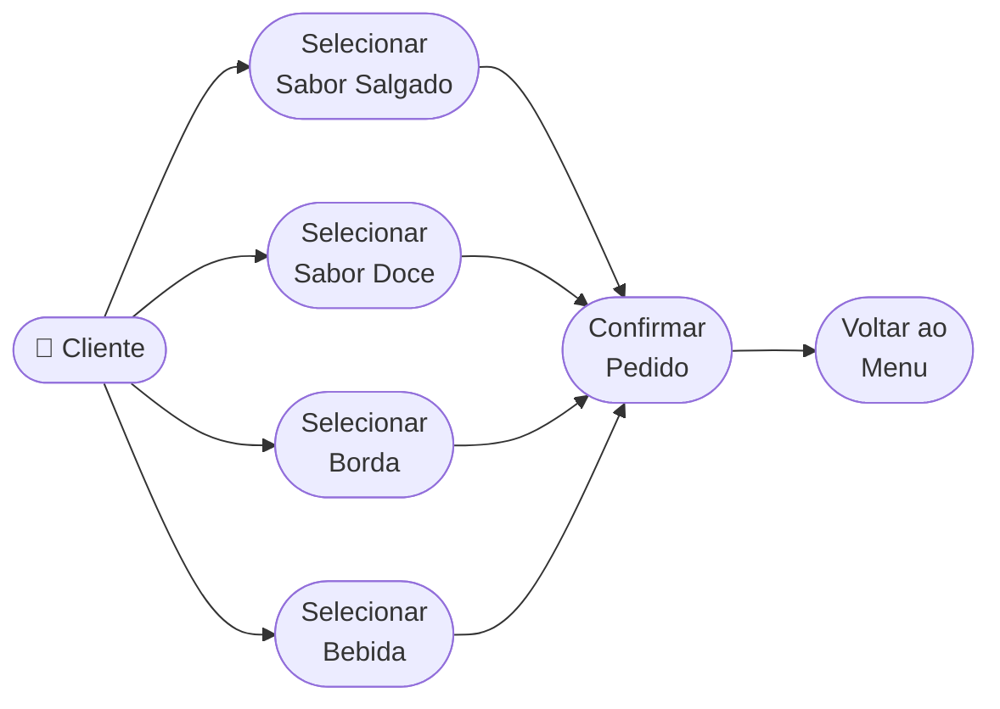

# 🔄 Casos de Uso (Use Cases)

## 👥 Atores

| Ator    | Descrição                                                  |
| ------- | ---------------------------------------------------------- |
| Cliente | Usuário final que utiliza o app para montar e fazer pedido |

## 📋 Casos de Uso (UC)

| ID   | Caso de Uso              | Ator Principal | Descrição                                           |
| ---- | ------------------------ | -------------- | --------------------------------------------------- |
| UC01 | Selecionar sabor salgado | Cliente        | Cliente navega para a lista e escolhe o sabor salgado |
| UC02 | Selecionar sabor doce    | Cliente        | Cliente navega para a lista e escolhe o sabor doce  |
| UC03 | Selecionar borda         | Cliente        | Cliente navega para a lista e escolhe o tipo de borda |
| UC04 | Selecionar bebida        | Cliente        | Cliente navega para a lista e escolhe a bebida      |
| UC05 | Confirmar pedido         | Cliente        | Cliente revisa o resumo e confirma o pedido         |
| UC06 | Voltar ao menu           | Cliente        | Cliente retorna ao menu principal a partir da confirmação |

---

## 📊 Diagrama de Casos de Uso

---

## 🛣️ Fluxos de Execução

### 📑 UC01 — Selecionar sabor salgado

**Pré-condição:** App aberto na tela "OPÇÕES DE PEDIDO"

**🟢 Fluxo principal:**
1. Cliente toca no botão "Sabores Salgados"
2. App navega para a tela com a lista de sabores salgados (Calabresa, Marguerita, Portuguesa)
3. Cliente toca em um sabor
4. App retorna à tela principal e exibe o sabor escolhido no lugar de "Sabores Salgados"

**🟡 Fluxo alternativo — trocar seleção:**
1. Cliente toca novamente no botão que já exibe um sabor escolhido
2. App navega novamente para a lista de sabores
3. Cliente toca em outro sabor — a seleção anterior é sobrescrita

**✅ Pós-condição:** O botão da categoria exibe o nome do sabor salgado selecionado

---

### 📑 UC05 — Confirmar pedido

**Pré-condição:** As quatro categorias foram selecionadas (ou pelo menos o necessário para ativar o botão)

**🟢 Fluxo principal:**
1. Cliente toca em "FAZER PEDIDO"
2. App navega para a tela de confirmação
3. Tela exibe: sabor salgado, sabor doce, borda e bebida escolhidos
4. Cliente visualiza o resumo do pedido

**🟡 Fluxo alternativo — voltar e alterar:**
1. Cliente toca em "Voltar"
2. App retorna ao menu de pedido com as seleções anteriores mantidas
3. Cliente pode alterar qualquer categoria e confirmar novamente

**✅ Pós-condição:** Pedido visualizado e registrado na tela de confirmação
