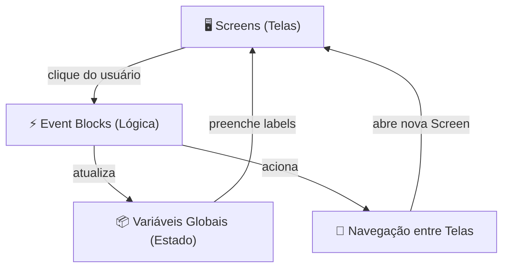

# 🏛️ Visão Geral da Arquitetura

## 📌 Contexto

O **PedePizza** é um aplicativo Android desenvolvido na plataforma **Kodular** — um ambiente
de desenvolvimento visual baseado em blocos, derivado do MIT App Inventor. Toda a lógica
do app é construída graficamente, sem escrita de código nativo.

A interface foi prototipada no **Figma** antes da implementação, garantindo consistência
visual entre o design e o produto final.

---

## 🗂️ Camadas do App

| Camada          | Responsabilidade                                              | Componentes Kodular         |
| --------------- | ------------------------------------------------------------- | --------------------------- |
| Interface (UI)  | Apresentação visual, botões, listas e navegação               | Screens, Buttons, ListView  |
| Lógica de evento| Resposta a interações do usuário e atualização de estado      | Event Blocks (clique, etc.) |
| Estado global   | Armazenamento temporário das seleções do usuário              | Variáveis globais           |
| Navegação       | Transição entre telas do app                                  | `open another screen`       |

---

## 📊 Diagrama de componentes

---

## 🖥️ Telas (Screens)

| Tela                  | Descrição                                                    |
| --------------------- | ------------------------------------------------------------ |
| Tela Principal        | Menu "OPÇÕES DE PEDIDO" com 4 categorias + botão FAZER PEDIDO |
| Tela Sabores Salgados | ListView com Calabresa, Marguerita, Portuguesa               |
| Tela Sabores Doces    | ListView com Prestígio, Banana Nevada, Oreo                  |
| Tela Bordas           | ListView com Catupiry, Cheddar, Doce de leite                |
| Tela Bebidas          | ListView com Guaraná, Coca-Cola, Água, Suco                  |
| Tela Confirmação      | Exibe resumo das 4 seleções + botão Voltar                   |

---

## 📦 Padrões adotados

| Padrão                     | Onde é aplicado                                                |
| -------------------------- | -------------------------------------------------------------- |
| Estado via variáveis globais | Seleções do usuário armazenadas entre navegações de tela     |
| Navegação por pilha        | `open another screen` empilha telas; botão Voltar desempilha  |
| Substituição de placeholder | Label do botão de categoria é trocado pela escolha do usuário |
| Desenvolvimento iterativo  | App evoluiu em 4 versões (APKs v1 → v4)                       |
